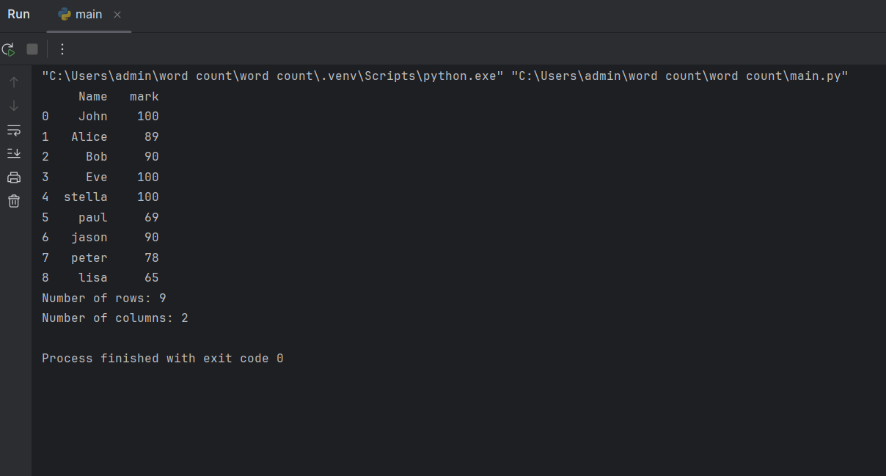

# Read-from-CSV

## AIM:
To write a python program for reading content from a CSV file.

## ALGORITHM:
### Step 1:
Import pandas as pd.

### Step 2:
Read the CSV file using read_csv method.

### Step 3:
Use head and tail method to get the required contents from the file.

### Step 4:
Use len() method to get the number of rows and columns.

### Step 5:
Display the result.

## PROGRAM:
```
import pandas as pd
df = pd.read_csv(r"C:\Users\admin\Desktop\blaa.csv")
print(df.head(9))
print("Number of rows:", len(df))
print("Number of columns:", len(df.columns))
```

## OUTPUT:


## RESULT:
Thus python program for reading content from a CSV file is successful.
